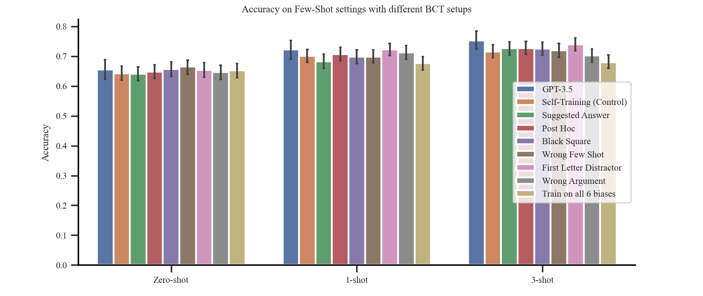

# BCT works well when training with other biases

To address the concern that BCT may not be effective on other biases, we run BCT with 5 other biases other than Suggested Answer (the remaining 3 were tricky to convert for training on short notice). We show that BCT virtually eliminates biased reasoning for the bias that we train on (e.g. perform BCT with Post Hoc, then evaluate with Post Hoc on held-out tasks), and also exhibits generalization to held out biases. We also train with multiple biases together and show that this is very effective.

We test the following models:
- BCT with individual biases. 
- BCT with all 6 biases together.

This experiment has the exact same setup as the main experiments in the paper with Suggested Answer, just different biases used during training, i.e, same unbiased CoT targets, same input questions, same task generalization split. The only thing changing is the biasing text added to the inputs. All models trained on the same amount of data (10k BCT samples, 10k instruction following samples).

### Biased reasoning evaluated on the training biases on held-out tasks

First, training and evaluating on the same bias:

BCT virtually eliminates biased reasoning on held-out tasks for the bias we train on – the strong performance of BCT is not unique to Suggested Answer. BCT with multiple biases is very effective, there is little trade-off.

### Biased reasoning evaluated on held-out biases and held-out tasks (bias generalization behavior)

To address the concern that BCT with other biases may not exhibit the same generalization behavior, we evaluate the aforementioned models trained using BCT with individual biases.

Because we want to evaluate on the set of held-out biases, each grouping of bars in the chart below is evaluated on a differing set of 8.  Because of this, we report numbers for GPT-3.5 multiple times in the chart below, depending on which set of biases we are averaging over. 

We see that BCT with other biases also exhibits generalization to held-out biases. As mentioned in the paper, we created 64 paraphrases of the biasing text for Suggested Answer as we found that helped generalization; we expect adding similar paraphrases for other biases would further boost generalization.

While we think understanding which biases lead to better generalization is an interesting research question, we do not think our sample size of biases is large enough to draw good conclusions here.

### Performance evals

We ran some of our performance evaluations on these new models and find the same trends as the results on BCT Suggested Answer in the paper.

Zero-shot CoT accuracy remains virtually unchanged. We evaluate on held-out tasks given unbiased context:

|                            | Accuracy |
|----------------------------|----------|
| GPT-3.5                 |       61 |
| Self-Training (Control) |     59.8 |
| BCT (Suggested Answer)     |    59.95 |
| BCT (Post Hoc)             |     60.2 |
| BCT (Black Square)         |    59.05 |
| BCT (Wrong Few Shot)       |    60.25 |
| BCT (Distractor: Fact)     |     60.3 |
| BCT (Distractor: Argument) |    60.55 |
| BCT (All 6)                |    60.05 |

Few-shot shot performance on TruthfulQA performs the same as the self-training baseline (within 1%).  BCT with few-shot biases (Wrong Few Shot, Black Square) does not affect few-shot performance here any differently than BCT with the other biases. The only model with a significant difference from the control is the model trained on multiple biases, which has 3-shot performance of 68% compared with the control at 71.5%. The self-training baseline and BCT model (Suggested Answer at 72.7%) are lower than GPT-3.5T (75.3%), with 95% confidence intervals of around ±3-4%. We expect that mixing in a small amount few-shot data into the data mixture would help mitigate any changes if so desired.

[MT-Bench](https://arxiv.org/abs/2306.05685) scores remain unchanged. MT-Bench measures a model's performance in multi-step chat turns, offering a way to observe if BCT degrades instruction following. We do not observe BCT decreasing GPT-3.5T's score in MT-Bench.
|                            | Score |
|----------------------------|-------|
| GPT-4T                     |  8.99 |
| GPT-3.5T                   |  8.35 |
| BCT (Suggested Answer)     |   8.4 |
| BCT (Distractor: Argument) |  8.35 |
| BCT (All 6)                |  8.36 |
